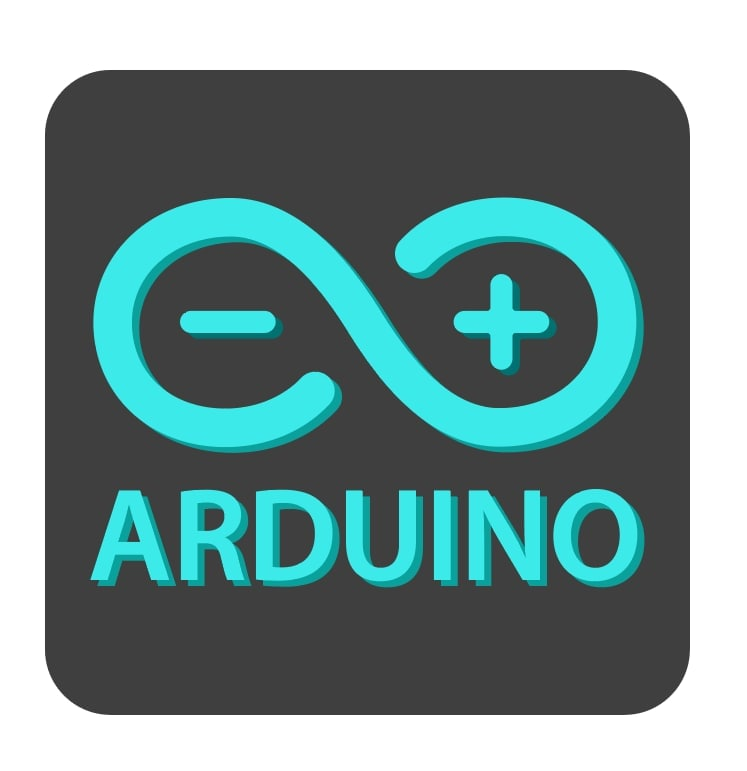

<!-- PROJECT LOGO -->
 

  

<h3 align="center">Arduino HandBook</h3>

  

    Отборочное задание для it-fest 2022. Сборник статей для arduino-разработчика.
  

<!-- TABLE OF CONTENTS -->

  
Содержание

  <ol>
    <li><a href="#Библиотеки">Библиотеки</a></li>
    <li><a href="#Для запуска">Для запуска</a></li>
    <li><a href="#Разработчики">Разработчики</a></li>
  </ol>

### Библиотеки

* [Android](https://developer.android.com/docs)
* [FireBase](https://firebase.google.com/docs/libraries)
* [Picasso](https://square.github.io/picasso/)

(<a href="#top">к содержанию</a>)

<!-- GETTING STARTED -->

## Для запуска

Чтобы запустить приложение надо скачать и установить apk-файл (main.apk) на Ваш смартфон.

(<a href="#top">к содержанию</a>)

<!-- CONTACT -->

## Разработчики

* Суханов Артём Алексеевич
* Криштопа Денис Алексеевич
* Цыканова Ксения Александровна

(<a href="#top">к содержанию</a>)

